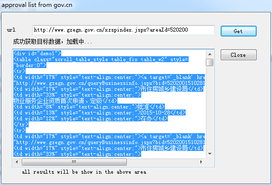

# approval-list
This app gets the data from a gov website.
detail description is on my website article "Html parser in C++"
*http://www.cppfun.com/html-parser-in-cpp.htm*

License
-

MIT

*http://www.cppfun.com*
